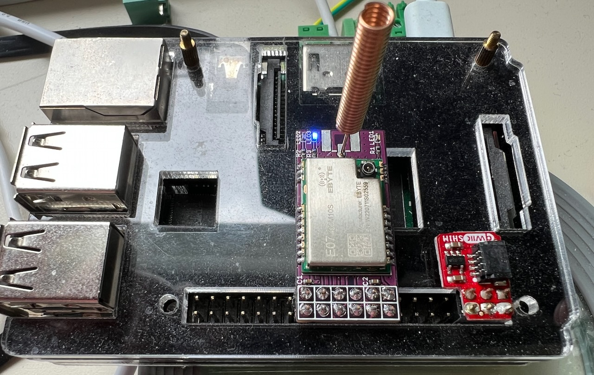

# everblu-meters-pi - Water usage data for MQTT

Fetch water/gas usage data from Cyble EverBlu meters using RADIAN protocol on 433Mhz. Integrated with MQTT. 

Meters supported:
- Itron EverBlu Cyble Enhanced

Software original code (but also all the hard work to get thingd working was originaly done [here][4] then put on github by @neutrinus [here][5].

I added some changes to the original firmware to work with my custom [shield][7] (including leds control), just plug, and play.

## Hardware



The project runs on Raspberry Pi with an RF transreciver (CC1101). 

You can check my dedicated [repo][7] for the already made hardware or look at the original [repo][5] if you want to build your own.


## Configuration

1. Enable SPI in raspi-config.
2. Install WiringPi from https://github.com/WiringPi/WiringPi/
3. Install libmosquitto-dev: `apt install libmosquitto-dev`
4. Set meter serial number and production date in `everblu_meters.c`, it can be found on the meter label itself:

5. Configure MQTT connection details in `everblu_meters.c`: `MQTT_HOST`, `MQTT_USER`, `MQTT_PASS`
6. Compile the code with `make`
7. Setup crontab to run it twice a day


To run with specific frequency (works with default frequency `433.82` here)

```shell
pi@raspberrypi:~/everblu-meters-pi $ ./everblu_meters 433.82
```

## Troubleshooting

### Frequency adjustment

Your transreciver module may be not calibrated correctly, please find working frequency enabling a scan setting frequency to `0`

To scan frequencies set frequency to 0

```shell
pi@raspberrypi:~/everblu-meters-pi $ ./everblu_meters 0
```

### Business hours

Your meter may be configured in such a way that is listens for request only during hours when data collectors work - to conserve energy. 
If you are unable to communicate with the meter, please try again during business hours (8-16).


```shell
pi@raspberrypi:~/everblu-meters-pi $ ./everblu_meters 433.82
CC1101 Version : 0x14
CC1101 found OK!
Consumption   : 467404 Liters
Battery left  : 173 Months
Read counter  : 165 times
Working hours : from 06H to 18H
```

Mine are 06H to 18H, don't know if they are UTC or local time with daligh saving.

### Serial number starting with 0

Please ignore the leading 0, provide serial in configuration without it.


### Save power

The meter has internal battery, which should last for 10 years when queried once a day. 

According Water manager here they need to change about 10/15 on each measure session, my previous one from 2017 was not working anymore, now they came and put a new one.


## Origin and license

This code is based on code from [lamaisonsimon][4]


The license is unknown, citing one of the authors (fred):

> I didn't put a license on this code maybe I should, I didn't know much about it in terms of licensing.
> this code was made by "looking" at the radian protocol which is said to be open source earlier in the page, I don't know if that helps?

# Links

There is a very nice port to ESP8266/ESP32: https://github.com/psykokwak-com/everblu-meters-esp8266

## Misc

See news and other projects on my [blog][2] 

[1]: https://www.cdebyte.com/products/E07-M1101S
[2]: https://hallard.me
[3]: https://oshpark.com/shared_projects/BVwV2j3b
[4]: http://www.lamaisonsimon.fr/wiki/doku.php?id=maison2:compteur_d_eau:compteur_d_eau
[5]: https://github.com/neutrinus/everblu-meters
[6]: https://github.com/hallard/everblu-meters-pi
[7]: https://github.com/hallard/cc1101-e07-pi


